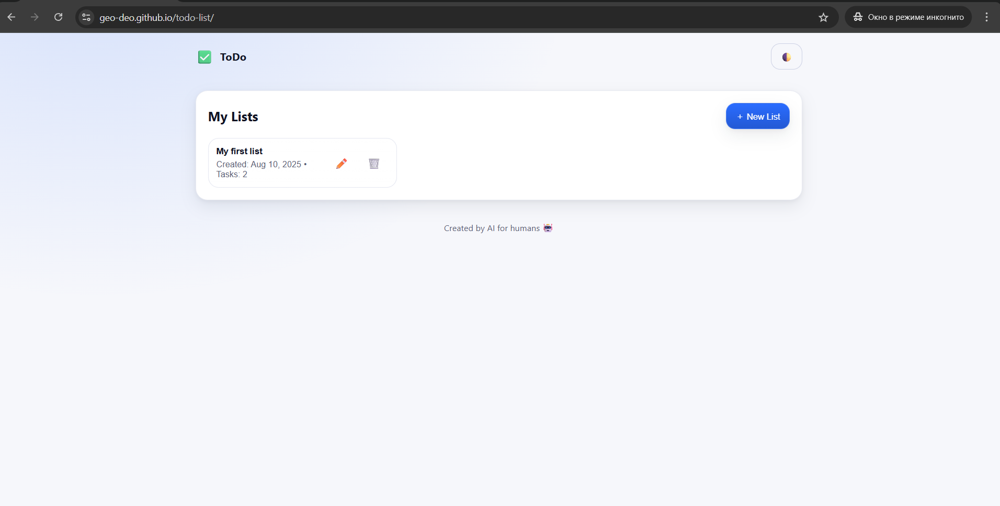
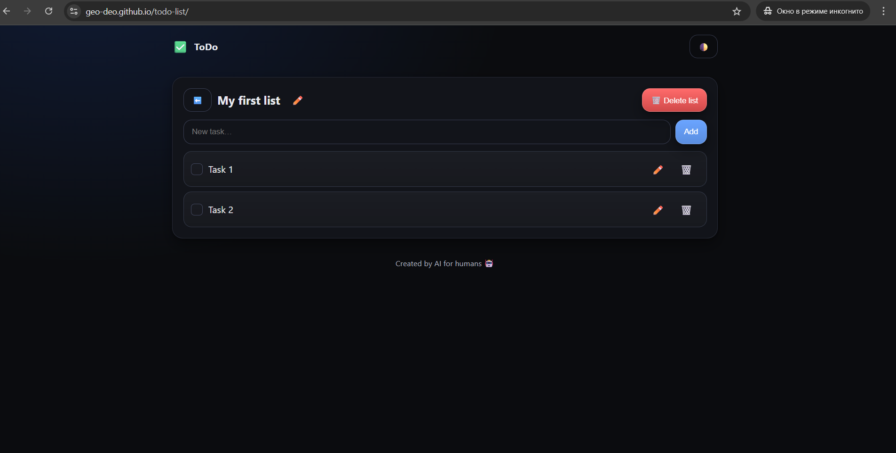
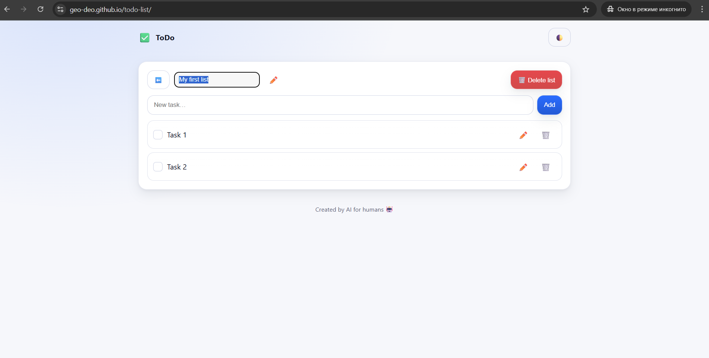

# To-Do List App

A modern, browser-based To-Do list application built with **HTML**, **CSS**, and **JavaScript**.  
Features inline editing, priority levels, dark theme, filters, and persistent storage via **localStorage**.

🔗 **Live Demo:** [https://geo-deo.github.io/todo-list/](https://geo-deo.github.io/todo-list/)


## ✨ Features
- **Create multiple lists**, each with its own tasks
- **Inline rename** for lists and tasks (✏️)
- **Checkbox completion** with visual state
- **Keyboard-friendly inputs** (Enter to add)
- **Persistent data via `localStorage`**
- **English dates and labels**


## 🖼 Preview

#### Main screen (Light theme)


#### Tasks screen (Dark theme)


#### Inline editing



## 📦 Installation
1. Clone the repository:
   ```bash
   git clone git@github.com:geo-deo/todo-list.git
   cd todo-list
2. Open index.html in your browser — no build tools needed.


## 📂 Project Structure
📦todo-list/
-  index.html # Main HTML page
-  style.css # Styles (light & dark themes)
- script.js # App logic
- README.md # Project description


## 🛠 Tech Stack
- **HTML5**
- **CSS3** (Custom properties, flexbox, responsive design)
- **Vanilla JavaScript** (ES6+)
- **localStorage** for data persistence